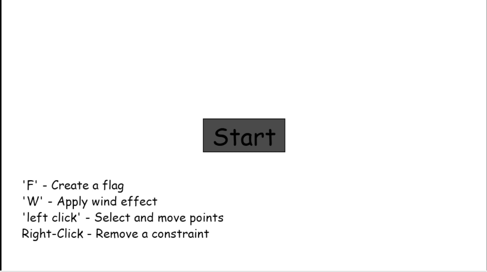

**Verlet Particle System Simulation**

A real-time cloth and flag simulation using Verlet integration, implemented in Python with Pygame. The system models particles connected by distance constraints, supports user interaction, and includes wind effects to animate the cloth dynamically.

---

## Features

* Verlet Integration for stable particle motion.
* Distance Constraints to simulate springs between particles.
* Cloth/Grid Generation: Create a grid of particles, with top row fixed to simulate cloth hanging.
* Wind Simulation: Toggleable wind force affecting particles.
* Interactive UI: Main menu, buttons, and text rendering.
* Configurable Parameters: Frame rate, grid size, spacing, integration steps.

---

## Demo

# main menu


# Demo


---

## Getting Started

No installation is required—simply download and run the precompiled executable.

1. Clone or download this repository:

   ```bash
   git clone https://github.com/YourUsername/verlet-system.git
   ```
2. Navigate to the `dist` (or root) folder where the executable is located.
3. Double‑click `VerletSystem.exe` (on Windows) or run the executable on your OS.

---

## Usage

Run the main application:

```bash
python main.py
```

* Use the main menu to start or exit the simulation.
* Press **W** to toggle wind on/off during the simulation.
* Click and drag particles to interact with the cloth.

---

## Controls

| Key / Mouse           | Action                               |
| --------------------- | ------------------------------------ |
| **W**                 | Toggle wind simulation               |
| **Left Mouse Button** | Select and drag individual particles |
| **ESC**               | Exit simulation or back to main menu |

---

## Configuration

Inside `main.py`, you can adjust:

* `FPS`: Simulation frame rate (default 200).
* `NUM_X`, `NUM_Y`: Grid dimensions for cloth particles.
* `spacing`: Particle spacing in pixels.
* `NUM_ITER`: Constraint solver iterations per frame.
* `delta_t`: Time step for Verlet integration.

---

## Contributing

1. Fork the repository
2. Create your feature branch (`git checkout -b feature/NewFeature`)
3. Commit your changes (`git commit -m 'Add NewFeature'`)
4. Push to the branch (`git push origin feature/NewFeature`)
5. Open a Pull Request

Please follow PEP8 style and include descriptive commit messages.

---

## License

This project is licensed under the MIT License. See the [LICENSE](LICENSE) file for details.


